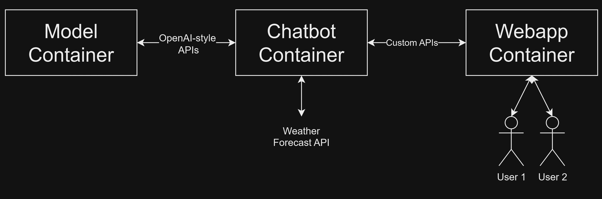

# Pirate Weather Chatbot

Simple toy project for the containerization course.

## Features

- Get current weather information
- Receive weather forecasts (up to 7 days in the future)
- Enjoy pirate-themed chatbot responses

## Containers structure

Three containers:
- Model container: runs the LLM and exposes generic openai-style restful apis
- Chatbot container: handles retrieval of weather information and calls the model container for chatbot responses
- Webapp container: runs the webapp



## Limitations
The bot only reports weather in Cesena for simplicity. Reporting information for different locations would require function calling, which would overcomplicate the project.

## Usage Instructions
The system can be built and started with:
```bash
docker-compose up --build
```

Some environment variables have to be setup to ensure the correct functioning:
- HF_TOKEN has to be set with the token of your huggingface API; which should have access to the model you are trying to use
- LLM_NAME name of the model to use in backend (if not specified, it defaults to "meta-llama/Llama-3.1-8B-Instruct")
- CUDA_VISIBLE_DEVICES has to contain the index of the chosen GPU to use. If not specified, the model will use gpu 0
- EXTERNAL_PORT indicates the external port at which the web service is exposed. If not specified it defaults to 37347